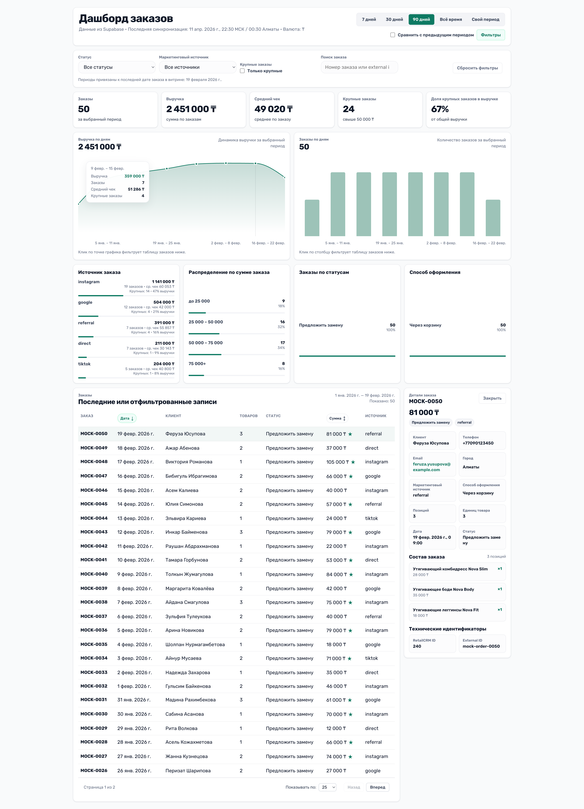
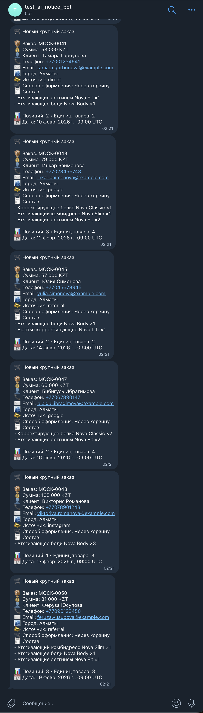

# RetailCRM → Supabase → Dashboard

Короткая версия README для быстрого просмотра проекта.

## Что сделано

Реализована полная цепочка:

- импорт 50 заказов из `mock_orders.json` в RetailCRM
- sync заказов из RetailCRM в Supabase
- дашборд на Next.js, который читает только Supabase
- Telegram alerts по заказам выше `50 000 KZT`
- деплой дашборда на Vercel
- единый локальный pipeline runner

## Ссылки

- **Vercel:** `https://gbc-analytics-dashboard-test-task.vercel.app`
- **GitHub:** `https://github.com/DavidGarguliya/gbc-analytics-dashboard-test-task`

## Архитектура

```text
mock_orders.json
  -> RetailCRM
  -> Supabase
  -> Dashboard / Telegram alerts
```

### Инварианты

- RetailCRM — upstream-источник заказов
- Supabase — единственный источник данных для dashboard и alerts
- dashboard не читает RetailCRM напрямую
- Telegram alerting работает только server-side
- alert rule: `total_sum > 50 000 KZT`

## Что было самым важным в разработке

Проект делался не “одним заходом”, а milestone-by-milestone, с зафиксированными инвариантами, ADR и governing docs.  
Это позволило не потерять контекст и не скатиться в хаотичную генерацию кода.

## Что умеет система

### Import
```bash
npm run import:retailcrm
```

### Sync
```bash
npm run sync:retailcrm
```

### Alerts
```bash
npm run alerts:telegram
```

### Полный pipeline
```bash
npm run pipeline
```

## Что показывает дашборд

- KPI по заказам и выручке
- динамику по периодам
- breakdown по статусам
- breakdown по маркетинговым источникам
- breakdown по способу оформления
- таблицу заказов
- детализацию заказа

## Что было нетривиальным

В процессе пришлось решить несколько реальных интеграционных проблем:

- live RetailCRM API возвращал не совсем ту форму данных, которую ожидал адаптер;
- повторный import работает как seed-import с duplicate rejection по `externalId`, а не как update path;
- live account сначала сохранял валюту как `RUB`, затем upstream-контракт был приведён к `KZT`;
- Telegram live verification потребовал явного `TELEGRAM_CHAT_ID`;
- `orders.source` исторически смешивал `utm_source` и `orderMethod`, поэтому source analytics пришлось разделить на:
  - `marketingSource`
  - `orderMethod`
- для полноценной source analytics пришлось создать `utm_source` в live RetailCRM account, затем сделать backfill и повторный sync

## Быстрый запуск

```bash
npm install
cp .env.example .env.local
```

Применить схему:
- `supabase/schema.sql`

Проверить проект:
```bash
npm run docs:golden
npm run lint
npm run typecheck
npm run test
npm run build
```

## Итог

Это не просто демо-экран, а рабочая цепочка:

`mock_orders.json → RetailCRM → Supabase → Dashboard → Telegram alerts → Vercel`

---

Подробнее: [полная инженерная версия README](./README_full.md)


## Скриншоты

    


